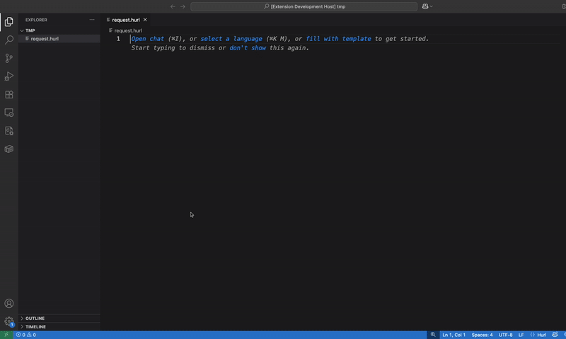

# Hurler

VS Code extension to run [Hurl files](https://hurl.dev) with syntax highlighting, environment variable support, and hover tooltips.


## Features

- ⚡ **One-click execution** - Run Hurl files with CodeLens buttons
- 🎨 **Syntax highlighting** - Full syntax support for Hurl files
- 🔍 **Hover tooltips** - See environment variable values on hover
- 📁 **Auto output** - Results saved to `.hurl.out` files automatically
- 🌍 **Environment variables** - Support for external variable files

## Usage

1. [Install Hurl](https://hurl.dev/docs/installation.html) - ensure it's accessible from terminal
2. Install this extension
3. Open a [Hurl file](https://hurl.dev/docs/hurl-file.html) 
4. Click the "▶️ Run Request" button that appears above HTTP methods
5. View results in the auto-opened `.hurl.out` file



## Configuration

Configure in VS Code Settings:

- `hurler.environmentFile` - Path to your environment variables file

### Environment Variables

Create an environment file (e.g., `env.txt`):
```
API_URL=https://api.example.com
TOKEN=your-api-token
```

Use in your Hurl file:
```hurl
GET {{API_URL}}/users
Authorization: Bearer {{TOKEN}}
```

Hover over `{{API_URL}}` to see the actual value!

